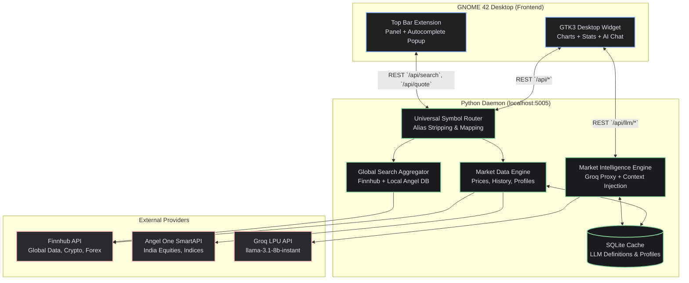

# Phase 3 Implementation Plan: Next-Gen Architecture & Features

This document outlines the system design for Phase 3 of the GNOME Stocks project, focusing on moving from a static/hardcoded architecture to a dynamic, API-driven, and highly scalable system with integrated educational AI features.

---

## 0. Strict Development Rules (Opus 4.6)

**CRITICAL RULE FOR CODE GENERATION (FAST MODE):** 
To conserve API rate limits and save tokens, the following rules MUST be strictly followed:
1. **CODE ONLY:** Focus purely on generating the codebase. Do not waste tokens on non-coding tasks.
2. **NO UNNECESSARY DIAGRAMS:** Never generate unnecessary diagrams (Mermaid, etc.) in `.md` files or implementation plans.
3. **NO CHATTY SUMMARIES:** Never produce verbose response messages or long implementation summary checklists in the chat after completing a task.
4. **MAXIMUM CONCISENESS:** Keep all explanations as short as possible and prioritize raw code output.

---

## 1. Universal Symbol Naming & Alias System

To eliminate hardcoding, the system will adopt a universal symbol representation across the Daemon, Extension, and Widget. 

### 1.1 Provider Conventions
The daemon will normalize incoming requests into provider-specific formats:
- **Finnhub (Global/US/Crypto/Forex)**
  - Stocks: `AAPL`, `NVDA`
  - Crypto: `BINANCE:BTCUSDT`, `COINBASE:ETH-USD`
  - Forex: `OANDA:EUR_USD`
  - Indices: `^GSPC`, `^DJI` (if supported via fallback)
- **Angel One (India - SmartAPI)**
  - Equity: `RELIANCE-EQ`, `TCS-EQ`
  - Indices: `NIFTY`, `SENSEX`, `BANKNIFTY`
  - Futures: Standardized contract codes (e.g., `RELIANCE27JUN24FUT`)

### 1.2 Alias & Normalization Layer (Daemon-Side)
When users search or enter symbols organically, the daemon will apply a normalization layer before querying providers:
- `*.NS` or `*.BO` suffixes will be stripped and routed to Angel One with the `-EQ` suffix (e.g., `TCS.NS` → `TCS-EQ`).
- `^NSEI` will map to the Angel One `NIFTY` token.
- `^BSESN` will map to the Angel One `SENSEX` token.
- Any symbol without a suffix or explicitly mapped prefix will default to Finnhub global search.

---

## 2. Dynamic Symbol Discovery (Global Search)

The static `symbols` array is obsolete. The system will leverage a dynamic, unified search aggregator.

### 2.1 Aggregation Strategy & UI Integration
When the user types a query `q` (min 2 chars) in **either the Desktop Widget search bar OR the GNOME Extension popup "Add Symbol" input**:
1. **Daemon `/api/search?q=...`** is called.
2. **Parallel Queries:**
   - Finnhub Search API (`/search?q=...`) for global equities and crypto.
   - Local/Cached Angel One Scrip Master JSON check for Indian instruments. 
   *(Note: Angel One provides a massive static JSON of all tokens. The daemon will download this daily and index it locally for lightning-fast regex/prefix searching).*
3. **Merge & Rank:** Results are normalized into a unified schema and ranked (e.g., matching exact prefixes first, ranking indices/large-cap higher).

**Extension Popup Integration:** The extension's `popup.js` will be heavily refactored. The static St.Entry text box will be upgraded to an autocomplete dropdown menu (using `St.BoxLayout` and `St.Button` for results) that live-fetches from `/api/search`, providing the exact same experience as the desktop widget.

### 2.2 Unified Output Schema
```json
{
  "symbol": "AAPL",
  "displayName": "Apple Inc.",
  "exchange": "NASDAQ",
  "type": "EQUITY",           // EQUITY, CRYPTO, FOREX, INDEX, FUTURES
  "provider": "finnhub"       // finnhub, angelone
}
```

---

## 3. Market Intelligence Engine (LLM API Integration)

Phase 3c merges both the "Beginner Mode" explanations and the "Market AI" chatbot into a unified LLM backend, drastically reducing code duplication and simplifying context management.

### 3.1 Architecture Overview
- **Provider:** Groq LPU API (Model: `llama-3.1-8b-instant` or `mixtral-8x7b`). Selected for its <100ms TTFT (Time To First Token) latency, ensuring instantaneous UI popovers without feeling sluggish.
- **Core Endpoints (Daemon):**
  - `/api/llm/explain` (for instant 2-sentence UI popovers).
  - `/api/llm/chat` (for the interactive sidebar chatbot).
- **Context Management:** Both endpoints silently receive the user's *current active stock profile* (Price, P/E, Cap, related news). The LLM is given this data in the system prompt so it never hallucinates current market values.
- **Caching (`/api/llm/explain` only):** SQLite persistent cache. Generic queries like "What is Market Cap?" are cached indefinitely to achieve 0ms latency and 0 token cost on subsequent clicks.

### 3.2 UI Integration (Stitch MCP "Market Signal")
- **Click-to-Explain:** Dash-underlined metrics in the stats grid trigger glassmorphism tooltips directly over the element.
- **The Chatbot Sidebar:** A sliding panel accessible via a "Market AI" FAB. Styled with the exact dark-mode, tonal-depth gradient bubbles defined in the design system.

### 3.3 Strict Guardrails
The Daemon's LLM proxy absolutely enforces non-financial-advice policies.
*System Prompt Requirement:* "You are an educational financial assistant. You MUST NOT provide financial advice, buy/sell recommendations, or price predictions. You only explain financial concepts, historical facts, and what indicators mean."

---

## 4. System Integration & Architecture Updates (Phase 3d)

The following diagram illustrates the finalized Phase 3 architecture. It highlights the introduction of the *Universal Symbol Router*, the *Global Search Aggregator*, and the integration of the *Groq LPU* for the Market Intelligence Engine.



### 4.1 Key Architectural Flow Changes
1. **Frontend Isolation:** Neither the Extension nor the Widget knows or cares about provider-specific formatting (e.g., `-EQ` vs `.NS`). They only communicate using the standardized payloads provided by the `/api/search` aggregator.
2. **Centralized Routing:** The entirely new `Universal Symbol Router` intercepts every request passing into the Daemon. It normalizes symbols early so `Market Data Engine` can transparently query Angel One or Finnhub.
3. **Dedicated AI Pipeline:** The new `Market Intelligence Engine` receives raw UI clicks (for explanations) or text inputs (for chat). It injects the context from the `Market Data Engine` locally, checks the `SQLite Cache`, and only hits the `Groq LPU API` if necessary.

## 5. Performance & Scalability Plan (Phase 3e)

With the introduction of global search aggregator and an LLM engine to both the GNOME Extension and Desktop Widget, aggressive optimization is required to prevent CPU spikes and battery drain.

### 5.1 Daemon & Search Optimizations
- **Local Ticker Indexing (O(1) Search):** The massive Angel One Scrip Master JSON (~70k symbols) will ONLY be hit via remote API once daily at startup. The daemon parses and caches this entire structure in memory (or SQLite), enabling instantaneous sub-millisecond local regex prefix matching for autocomplete search.
- **Batched Market Data Polling:** To prevent rate-limit bans when a user has a watchlist of 20+ symbols, the Universal Symbol Router will bundle all `-EQ` queries into a single Angel One bulk-quote request. Finnhub limits will be respected via intelligent staggered queuing.
- **Multi-tiered Caching Strategy:**
  - *Profiles & Keys Stats:* HTTP `Cache-Control` max-age of 24 Hours.
  - *Historical Charts (1D+):* Cached in-process for 5-15 minutes (since daily candles don't move minute-by-minute).
  - *LLM Proxy:* The Groq Market Intelligence Engine has a dedicated SQLite caching layer. Queries matching `Provider + Term + Active Symbol Data Hash` are cached indefinitely.

### 5.2 UI Rendering Optimizations (Widget & Extension)
- **Aggressive Input Debouncing:** The new Gnome shell popup search input (`popup.js`) and the Widget Search bar are strictly debounced by 300ms using `GLib.timeout_add` or Javascript `setTimeout`. Keystrokes will never spam the `/api/search` endpoint.
- **Intelligent Diff Rendering:** The Extension Panel and Widget DOM must compare incoming JSON states against current local state (e.g., `_state.lastPanelText`). Updates to the UI are aborted if the text hasn't changed, saving GNOME Shell redraw cycles.
- **Throttled Background Activity:** The GTK3 WebKit2 widget will pause active data polling via the JavaScript `Visibility API` when the window is minimized or covered by other windows. LLM Chat rendering will use `requestAnimationFrame` to ensure smooth sliding transitions without layout thrashing.

---

## 6. Phase 3.5: Final Polish & UI Fixes (Pre-Phase 4)

Before moving to cloud infrastructure, several UX gaps in the Widget and Extension need to be resolved:

### 6.1 Branding & UI Refinements
*   **GNOME AI Branding:** Rename all instances of "Market AI" to "GNOME AI" in both the widget button and chat header. Remove the `🤖` emoji to fit the sleek GNOME aesthetic.
*   **Manage Portfolio:** Remove the "Manage Portfolio" button from the sidebar as this feature is currently **deferred** for now.
*   **Dashboard Filter Pills:** Currently, the pills (Stocks, Crypto, Currencies, etc.) only filter the dropdown search results. *Proposed Approach:* Wire the pills to dynamically update the home dashboard cards and fetch category-specific news. 
    *   **All / Stocks:** NIFTY, SENSEX, S&P 500, DOW. News: SPY/Market news.
    *   **Crypto:** `BTC-USD`, `ETH-USD`, `SOL-USD`, `DOGE-USD`. News: Crypto/BTC news.
    *   **Currencies:** `INR=X`, `EUR=X`, `GBP=X`, `JPY=X`. News: Forex/Currency news.
    *   **Futures:** `CL=F` (Crude), `GC=F` (Gold), `SI=F` (Silver), `NG=F` (Nat Gas). News: Commodities news.
    *   **ETFs:** `SPY`, `QQQ`, `VTI`, `ARKK`. News: ETF news.
    *   *All news feeds triggered by these pills will have clickable source URLs.*

### 6.2 Watchlist UX Overhaul
*   **Autocomplete for Watchlist Addition:** 
    *   **Widget Fix:** The current `+` button triggers a native browser `prompt()`. Change the `+` button in the sidebar to simply focus the main search bar at the top (`#search-input`). Add a Star (`★`) toggle button next to the company name in the Stock Detail view. Users search for a stock, open it, and click the star to add/remove it.
    *   **Extension Fix:** The GNOME Extension's `popup.js` already has an "Add Symbol" box that fetches autocomplete data. However, there is a UI rendering bug where `this._autocompleteBox.visible = true;` is missing in the HTTP callback, meaning the dropdown remains invisible even when it successfully finds results. We will fix this exact line in `popup.js`.
*   **Watchlist Deletion:** Add a `✕` (remove) button to each item in the watchlist sidebar that appears on hover, allowing quick deletion.

### 6.3 News Deep-linking
*   **Clickable News Cards:** Wrap both the home dashboard news cards and the stock-specific news cards in `<a>` tags with `target="_blank"` so they open the source article in the default web browser.
*   **View All Link:** Make the "View All" text clickable, linking out to a generic market news aggregator (e.g., Yahoo Finance News).

---

## 7. Phase 4: Cloud Infrastructure & MCP Integration

To transition GNOME Stocks from a local tool to a universally available extension with cloud-synced accounts, Phase 4 will strategically utilize the following Model Context Protocol (MCP) servers:

### 6.1 Selected MCP Stack
1. **Cloud Run MCP (Deployment):** Migrate the `api_server.py` Flask daemon from `localhost` to a Serverless Google Cloud Run container. This removes the requirement for users to run a Python background process.
2. **Supabase MCP (Storage & Sync):** Replace the local `config.json` with a cloud Postgres schema for user accounts. Watchlists and panel settings will sync seamlessly across multiple GNOME machines.
3. **Sequential Thinking MCP (Logic & System Design):** A completely free, built-in tool that provides structured reasoning capabilities. We will use this to break down complex, multi-step asynchronous logic (like preventing race conditions between the GNOME UI and the polling daemon).
4. **SonarQube & GitHub MCPs (CI/CD):** Enforce strict code quality on the GJS extension to pass GNOME Extension Store validation, and manage GitHub releases. 

### 6.2 Architectural Migration Steps
* **Step 1:** Containerize `api_server.py` and deploy via Cloud Run. Update Extension and Widget to point to the new remote URL.
* **Step 2:** Integrate Supabase REST capabilities to store the `watchlist` and `settings` objects.
* **Step 3:** Setup SonarQube workflows to prep the codebase for the GNOME Extensions platform.

## 8. Free Deployment Options & CI/CD Strategies (API Server)

Since you need a **100% free hosting platform** with **automated CI/CD pipelines** triggered by git events, the options have been re-evaluated (Koyeb has been removed as it no longer offers a free tier).

### 8.1 Render (Recommended for Simple Python Setup)
*   **How CI/CD Works:** Connects directly to your GitHub repository. Any push to the `main` branch automatically triggers a build and deploy pipeline.
*   **Pros:** Native Python environment, auto-deploys on git push, handles environment secrets securely, completely free.
*   **Cons:** Spindown on 15 minutes of inactivity (causing a 50s cold-start on the first query from GNOME shell).
*   **Setup:** Point Render to the repository, set the build command to `pip install -r requirements.txt`, and start command to `python stocks-daemon/api_server.py`.

### 8.2 Vercel Serverless Functions (Recommended for 24/7 Zero Cold-Start)
*   **How CI/CD Works:** Full integration with GitHub. Auto-deploys on git push, offers preview deployments for pull requests, and production deployment on merge to `main`.
*   **Pros:** Edge-routing, zero cold-starts, high reliability, completely free.
*   **Cons:** Flask code must be served as serverless functions.
*   **Setup:** Wrap the server in a serverless entrypoint (e.g. `index.py`) using `wsgi` routing, add a `vercel.json` configuration, and move dependencies to root.

### 8.3 Hugging Face Spaces (Dockerized 24/7 Free Hosting)
*   **How CI/CD Works:** Can be integrated with GitHub Actions. On git push, a GitHub Action workflow automatically pushes the Docker setup to Hugging Face Git, triggering a build and deploy.
*   **Pros:** 24/7 continuous runtime (no sleeping/cold-starts), generous resources (16GB RAM).
*   **Cons:** Setting up CI/CD requires writing a custom GitHub Actions `.yml` workflow file to mirror updates.
*   **Setup:** Create a space, write a custom `Dockerfile` exposing port `7860`, and set up SSH keys in GitHub Secrets for automatic pushes.


